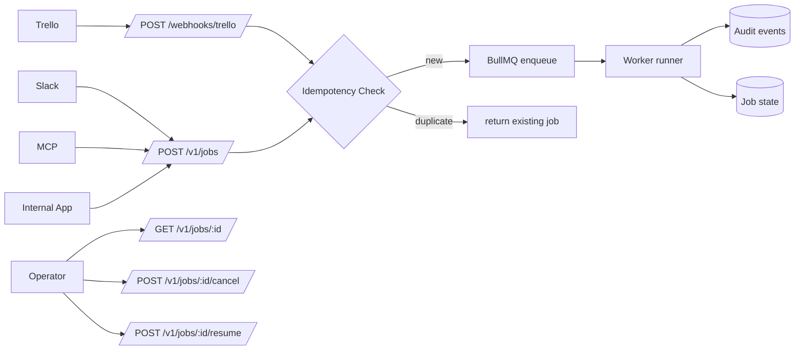

# Draftsman No. 9 API Design Doc

## Problem Context

Current API is too thin for ticket-to-PR automation. Today we only have:

- `GET /health`
- `POST /webhooks/trello` (command parse only)

Pain points:

- No durable job API, so no clean integration surface for Slack/MCP/internal app
- Risk of duplicate runs for same task
- No first-class cancel flow (`nevermind`, deleted Slack message, Trello unassign)
- No standard audit API for debugging and trust

Priority is Trello webhook reliability first. MCP is later.

## Proposed Solution

Ship a versioned `/v1` API centered on a durable `job` resource. Keep webhook ingress for Trello, but normalize all sources into one lifecycle.

- What it will do
- Accept invocations from Trello/Slack/MCP/internal app
- Enforce idempotent job creation
- Support cancel and human resume
- Expose append-only audit events + job summary
- How it will be built
- Bun HTTP server with route modules
- Postgres for jobs/audit/config
- BullMQ for queue and retry
- Signature verification/API key auth per source
- What’s different from current state
- Parse-only webhook becomes enqueue + lifecycle tracking
- All channels share one contract
- Key advantages
- Prevent accidental duplicate runs
- Clean operational debugging
- Easy later MCP exposure

## Goals and Non-Goals

### Goals

- Goal 1: deterministic, idempotent job creation from external events
- Goal 2: simple cancel and resume controls across channels
- Goal 3: auditable end-to-end job timeline with stable API contracts

### Non-Goals

- Non-goal 1 (explain why out of scope): full RBAC and enterprise auth stack; overkill for 1-user v1
- Non-goal 2: backwards compatibility guarantees; no current users to migrate

## Design

All invocations map to one `job` lifecycle: `queued -> running -> waiting_for_input | succeeded | failed | canceled`.



### Key Components

#### Component A

Ingress, auth, idempotent creation.

- `GET /health`
- Params: none
- Response: `{ ok: true, service: "api" }`

- `POST /webhooks/trello`
- Headers: `x-trello-webhook`, `x-trello-signature`, `x-request-id`
- Body: Trello action payload
- Behavior:
- validate signature
- map event to invocation intent
- compute `idempotency_key = "trello:{action_id}"`
- create job if new, else return existing
- Response: `202 Accepted` with `{ accepted: true, job_id, deduped }`

- `POST /v1/jobs`
- Headers: `authorization: Bearer <token>`, `x-request-id`, optional `idempotency-key`
- Body:

```json
{
  "source": "slack",
  "mode": "fix",
  "ticket": {
    "provider": "slack",
    "external_id": "msg_123",
    "url": "https://slack.com/archives/C1/p1",
    "title": "Fix checkout bug",
    "text": "@draftsman fix"
  },
  "repo_hint": { "owner": "org", "name": "repo" },
  "requested_skills": ["playwright-repro-triage"],
  "repro": { "enabled": false },
  "overrides": { "allow_no_validation": false, "allow_dependency_changes": false }
}
```

#### Component B

Lifecycle query/control.

- `GET /v1/jobs`
- Query: `status`, `mode`, `repo`, `source`, `cursor`, `limit`

- `GET /v1/jobs/:job_id`
- Query: `include=audit_summary,artifacts,delivery`

- `GET /v1/jobs/:job_id/audit`
- Query: `cursor`, `limit`, `kind`, `since`
- Best practice: one append-only event stream endpoint with typed events + filters

- `POST /v1/jobs/:job_id/resume`
- Body: `{ "question_id": "q_123", "answer": { "type": "option", "value": "..." }, "answered_by": "carter@example.com" }`

- `POST /v1/jobs/:job_id/cancel`
- Body: `{ "reason": "user_nevermind", "requested_by": "carter@example.com" }`
- Cancel policy:
- queued/waiting jobs: immediate cancel
- running jobs: cooperative cancel signal, then forced terminal `canceled` if runner confirms stop or timeout

#### Component C

External event-driven auto-cancel rules.

- Slack:
- `message_deleted` for invocation message -> auto-cancel if job not terminal
- explicit reply/command `nevermind` -> auto-cancel
- Trello:
- card unassign from Draftsman user (or explicit stop label/comment command) -> auto-cancel
- MCP/internal:
- explicit cancel API call only

All auto-cancels generate audit events with source metadata.

## Alternatives Considered

| Alternative | Pros | Cons | Why Not Chosen |
|-------------|------|------|----------------|
| Trello-only webhook API | fastest initial build | hard to extend, no shared contract | does not solve Slack/MCP path |
| No cancel endpoint, manual operator intervention | simpler worker logic | bad UX, wasted compute, no clean stop semantics | you explicitly want cancel |
| Split audit endpoints by event type | easy per-view integration | more routes, inconsistent pagination | single stream + filters is cleaner |

## Open Questions

- [ ] Should auto-cancel on Slack delete apply to thread replies too, or only the original invocation message?
- [ ] What retention period should we use for full audit event payloads vs compressed summaries?

## Implementation Plan

### - [ ] Phase 1: Foundation
- [ ] Add `/v1` router and route modules
- [ ] Add request auth middleware (Trello signature, Slack signature, bearer token)
- [ ] Add idempotency key service (`source + external event id`)
- [ ] Add Postgres tables: `jobs`, `job_events`, `job_cancellations`
- [ ] Add shared response/error schema helpers

### - [ ] Phase 2: Core Implementation
- [ ] Implement `POST /webhooks/trello` enqueue + dedupe + `202` response
- [ ] Implement `POST /v1/jobs`, `GET /v1/jobs`, `GET /v1/jobs/:job_id`
- [ ] Implement `GET /v1/jobs/:job_id/audit` with cursor pagination
- [ ] Implement `POST /v1/jobs/:job_id/cancel` and worker cooperative cancel
- [ ] Implement `POST /v1/jobs/:job_id/resume`
- [ ] Implement auto-cancel adapters for Slack/Trello events

### - [ ] Phase 3: Polish & Testing
- [ ] Write tests
- [ ] Route tests for all endpoints and error cases
- [ ] Idempotency tests: duplicate events return same `job_id`
- [ ] Cancel tests: queued, running, waiting states
- [ ] Audit tests: append-only ordering + pagination
- [ ] Auth tests: reject unsigned/invalid external requests
- [ ] Update `README.md` API and lifecycle docs

## Appendix

- Current API: `apps/api/src/server.ts`
- Current API tests: `apps/api/src/server.test.ts`
- Invocation types: `packages/core/src/index.ts`
- Related plans: `TRELLO_DELIVERY_PLAN.md`, `INVOCATION_TRIGGER_PLAN.md`, `BULLMQ_SETUP_PLAN.md`, `DOCKER_EXECUTION_PLAN.md`
