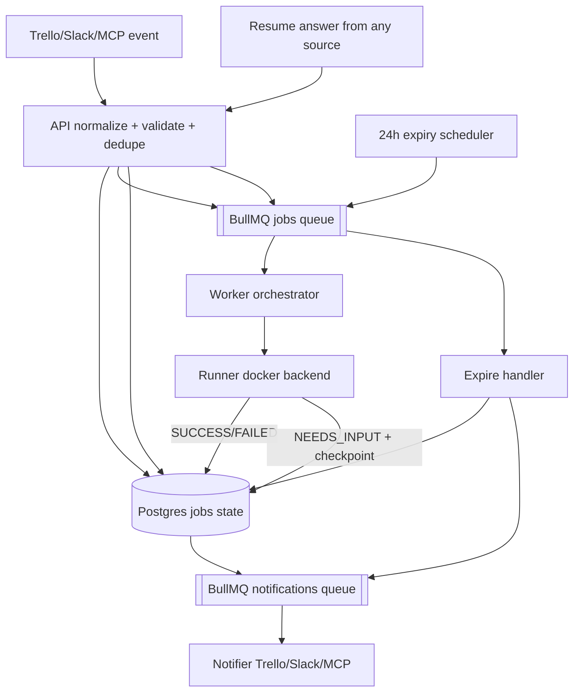

# Draftsman No. 9 Design Doc

## Problem Context

Draftsman needs durable job orchestration from Trello/Slack/MCP with human checkpoints. Current code accepts Trello invocation but worker is a polling stub, no BullMQ processing, no persisted pause/resume state, no TTL auto-fail path.

Pain points now:
- No real queue/retry semantics.
- No safe way to pause for input without blocking worker capacity.
- No cross-channel resume model (start on Trello, answer in MCP).
- No deterministic timeout behavior for unanswered questions.

## Proposed Solution

Implement BullMQ-driven orchestration with DB-backed lifecycle and checkpointing.

- Core jobs run on `draftsman:jobs`.
- Notifications run on separate `draftsman:notifications`.
- Worker persists `waiting_for_input` and exits job cleanly.
- Questions expire at 24h; expiration auto-fails job and sends delivery notifications.
- Resume can come from any supported source (Trello/Slack/MCP), validated against job/question state + auth.
- API stays the single ingress for all source events and enqueues `start|resume|expire` actions.

Key advantages:
- No worker slot pinned while waiting.
- Better reliability under Slack/Trello API latency.
- Clear audit trail for every transition and outbound message.
- Cross-channel human loop supports MCP-first workflow.

## Goals and Non-Goals

### Goals

- Goal 1: Durable BullMQ orchestration with deterministic retries and idempotency.
- Goal 2: Human-input pause/resume flow with 24h expiry and auto-fail notification.
- Goal 3: Cross-source resume support so job can start in one channel and resume in MCP.

### Non-Goals

- Non-goal 1: Multi-day suspended execution in runner process memory (out of scope; use DB checkpoints).
- Non-goal 2: Advanced notification preference engine (v1 sends required system messages only).

## Design

Control plane owns state transitions. Runner is stateless between invocations and resumes from checkpoint.

### Key Components

#### Component A: Queue Topology

- `draftsman:jobs`
- Handles orchestration actions: `start`, `resume`, `expire_waiting_input`.
- Retries for system failures only.

- `draftsman:notifications`
- Handles outbound Trello/Slack/MCP sends.
- Failures here never re-run core code execution.
- Retries + dead-letter/audit warnings.

#### Component B: Lifecycle + State Model

- `queued -> running -> waiting_for_input -> resumed -> running -> completed|failed|canceled|expired`
- `expired` is terminal and used for 24h unanswered checkpoints.
- Transition guard in code and DB constraint layer.
- Resume only allowed when question is open and not expired.

#### Component C: Human Question Model

- `job_questions` record includes:
- `question_id`
- `job_id`
- `checkpoint_id`
- `asked_at`
- `expires_at = asked_at + 24h`
- `status = open|answered|expired`
- `delivery_targets` (trello card/thread, slack channel/thread, mcp session ref)

- `job_answers` record includes:
- source (`trello|slack|mcp`)
- responder identity
- payload
- answer timestamp
- source event id (idempotency key)

#### Component D: Cross-Channel Resume

- Any source can answer if:
- question `status=open`
- question not expired
- responder authorized for workspace/job policy
- idempotency key not previously consumed

- API normalizes answer payload, persists it, then enqueues `resume`.
- Worker reloads full job + checkpoint + answer from DB, never trusts queue payload alone.

#### Component E: Expiration + Auto-Fail

- Add delayed BullMQ job at question creation for `expire_waiting_input` at +24h.
- Expire handler checks question still open; if answered, no-op.
- If still open:
- mark question expired
- mark job expired
- enqueue notifications to source-of-origin plus MCP.

#### Component F: Operations Profile (BullMQ + Redis)

- Queue concurrency and priority defaults:
- `draftsman:jobs` worker concurrency: `5` (CPU-bound orchestration stays controlled).
- `draftsman:notifications` worker concurrency: `20` (I/O-heavy sends).
- Job priority mapping for `draftsman:jobs`: `resume=1`, `expire_waiting_input=2`, `start=3` (lower number = higher priority).
- Notification queue uses FIFO per channel target; no strict global ordering requirement.

- Dead-letter and alerting policy:
- `draftsman:jobs`: `attempts=3`, exponential backoff + jitter, then terminal fail and audit event `queue_job_dead`.
- `draftsman:notifications`: `attempts=5`, backoff + jitter, then move to dead-letter set with payload snapshot.
- On any dead-letter event, emit:
- audit event in Postgres
- Slack ops alert (or MCP ops sink when available)
- daily digest of unresolved dead-letter jobs.

- Redis durability and eviction baseline:
- Redis configured with AOF enabled (`appendonly yes`) for queue durability.
- Snapshotting enabled with conservative intervals for faster recovery.
- `maxmemory-policy noeviction` to avoid silent BullMQ key loss under pressure.
- Dedicated Redis DB/index for BullMQ keys; avoid mixing unrelated cache keys.
- Add queue health checks: lag, failed count, delayed count, dead-letter count.

## Alternatives Considered

| Alternative | Pros | Cons | Why Not Chosen |
|-------------|------|------|----------------|
| Single queue for jobs + notifications | Simple setup | Notification API latency/backoff can block execution throughput | Not chosen; poor isolation |
| Hold BullMQ job open while waiting for input | Easy mental model | Pins worker slot for hours, stall risk, messy retries | Not chosen; bad capacity behavior |
| Resume only from source-of-origin | Simpler auth/routing | Breaks MCP-first workflow and operator flexibility | Not chosen; conflicts with requirement |

## Open Questions

- [ ] None currently.

## Implementation Plan

### - [ ] Phase 1: Foundation
- [ ] Add BullMQ + Redis shared connection factory.
- [ ] Create `draftsman:jobs` and `draftsman:notifications`.
- [ ] Replace worker polling loop with BullMQ processor.
- [ ] Add deterministic enqueue id strategy (`source:event_id`).

### - [ ] Phase 2: Core Implementation
- [ ] Add DB tables for jobs, checkpoints, questions, answers.
- [ ] Implement lifecycle transition guard logic.
- [ ] Implement runner outcome contract: `SUCCESS|FAILED|NEEDS_INPUT`.
- [ ] Implement `resume` ingestion from Trello/Slack/MCP.
- [ ] Implement delayed expiry job at +24h and auto-fail path.
- [ ] Implement notifier worker for Trello/Slack/MCP outbound updates.

### - [ ] Phase 3: Polish & Testing
- [ ] Write tests
- [ ] Unit: dedupe, transitions, expiry handler, cross-source resume auth/idempotency.
- [ ] Integration: start -> needs_input -> resume -> complete.
- [ ] Integration: start -> needs_input -> 24h expiry -> auto-fail + notifications.
- [ ] Integration: dead-letter behavior emits audit + ops alert.
- [ ] Documentation
- [ ] Update `README.md` and keep `BULLMQ_SETUP_PLAN.md` as supplemental notes.

## Appendix

- Existing working notes: `BULLMQ_SETUP_PLAN.md`
- Related docs:
- `INVOCATION_TRIGGER_PLAN.md`
- `TRELLO_DELIVERY_PLAN.md`
- `DOCKER_EXECUTION_PLAN.md`

---

Open questions to discuss:
1. None currently.

Ready to refine any section or proceed to implementation?
